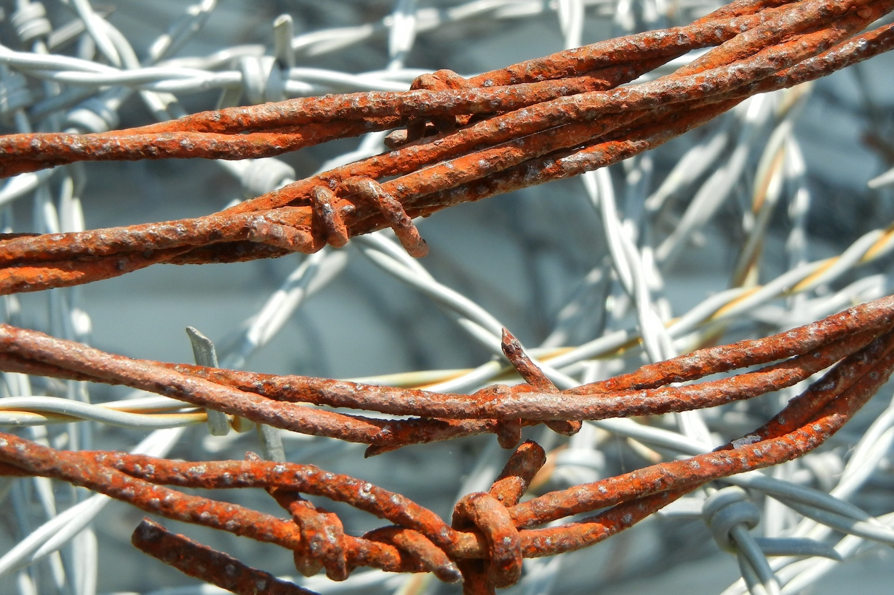

# barbed

> [!CAUTION]
> This project is pretty much experimental and new releases WILL BREAK, VERY OFTEN.

`barbed` is a small Rust crate for [Twitch integrations](https://dev.twitch.tv/docs/api/).

It currently includes:

- OAuth (authorize URL, device code flow, token refresh, signed state verification)
- Helix request builders and response parsers
- EventSub WebSocket decoding, chat subscription helpers, and a native async stream client
- HMAC signing helpers for short-lived tokens and state payloads

The default crate is runtime-agnostic. Optional feature flags add integrations for specific runtimes:

- `cloudflare-worker` — send prepared requests via the Cloudflare Workers Fetch API
- `reqwest-client` — native HTTP helpers built on `reqwest`
- `tokio-eventsub` — native EventSub WebSocket client using `tokio` and `tungstenite`

> [!NOTE]
> Disclaimer: this crate is heavily vibecoded, if you don't like it, don't use it.
